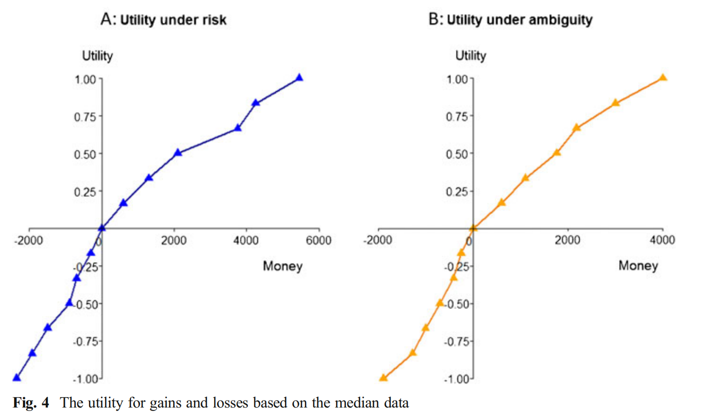

```{r setup, include=FALSE}
knitr::opts_chunk$set(echo = TRUE,fig.align = "center", warning = FALSE)
library(R6)
library(tidyverse)
# library(magrittr)
# import functions
# source("functions/exper_simu_functions.R")
source("functions/exper_simu_functions_new.R")
source("functions/loss_aver_functions.R")
theme_set(theme_bw())
```

# Review
## Fox 2014

1.  Statistical methods
    -  Certainty Equivalents
2.  Nonparametric methods
    -  Tradeoff (TO) Method (Wakker and Deneffe, 1996)
      +   Choice b/t 2 prospects  
$$
(x_i,p;r) \sim (x_0,p;R); (x_2, p;r) \sim (x_1, p; R)
$$
3.  ~~Semiparametric methods~~  
4.  Parametric methods  
    -   Assuming the Utility function and weighting function form.  
    -   Estimation: MLE or Hierarchical Bayesian Modeling for individual parameters.


# Simualtion

**Goal: to simulate choice data following KT 1992's parametric form and trying to recover parameters.**  
The Choice data was simulate as following:  

-    For each binary gamble, the actor evaluate the utility (prospect) as the power utility function (Tversky and Kahnaman, 1992):  
\[
U(x) = \begin{cases}
x^\alpha & \text{if } x\geq0,\\
-\lambda x^\beta& \text{otherwise},
\end{cases}
\]

where $\lambda>0$ as loss aversion coefficient in CPT.  

-   When facing 2 gambles (A, B), the probability of choosing gamble A follows a 
softmax choice rule:
\[
\text{Pr}(A) = \frac{1}{1+\exp[\phi(\text U(B)-\text U(A)])} 
\]
where $\phi$ in the coefficient of inverse-temperature.

## Simulation parameter setup

Using the famous parameter estimates in TK1992, $\alpha =.88, \beta=.88,\lambda =2.25$, generate N data from this chooser. For error of choice, we choose 
$\phi = .1$.


### Functions:

Simulate data:
```{r simu fun}
choose_rep_N <- function(Nsim, alpha =.88, beta=.88 ,lambda =2.25, phi =.1,
                         u_func = c("CRRA","CARA"),
                         show.1 = F, # show task_log
                         show.2 = T) # show lotteries_box)
{
  u_func <- match.arg(u_func)
  for (i in 1:Nsim){
    test_result <- experiment(alpha, beta, lambda, phi,u_func,
                              show.1, show.2) #TK, 1992, phi=.1
    #cat(i)
    if (i==1){
      utilf <-  c(test_result[[1]][1:16])
    }else{
      utilf <- c(utilf, test_result[[1]][1:16])
    }
  }
  # Matrix
  utilf <- cbind(1:Nsim,
                 matrix(utilf, nrow = Nsim, ncol=16, byrow = T))
  # data_frame
  df <- utilf %>%
    as_tibble() %>%
    magrittr::set_colnames(
      c("subject",str_glue('x{c(1:8)}_gain'),str_glue('x{c(1:8)}_loss')))
  # long_data
  # df_long <- df %>% 
  #   pivot_longer(cols = starts_with("x"),
  #                names_pattern = "x(\\d)_(gain|loss)",
  #                names_to = c("trial", "domain"), 
  #                values_to = "outcome") %>% 
  #   nest(data = c(trial, domain, outcome)) 
  
  sim_result <- list(matrix = utilf, 
       df = df)
       # df_long = df_long)
  return(sim_result)
}
```
Estimating $\alpha, \beta$
```{r function for estimate}
est_alpha_beta <- function(data_matrix, scale_by =8){
  u = c(1,2,3,4,5,6,7,8,-1,-2,-3,-4,-5,-6,-7,-8)/scale_by # set U(x8+)=1 and U(x8-)=1
  
  ## double scaling wrt pos and neg
  
  data_matrix[,2:9] = data_matrix[,2:9]/data_matrix[,scale_by+1]
  data_matrix[,10:17] = data_matrix[,10:17]/-data_matrix[,scale_by+9]

  # data_matrix[,2:9] = data_matrix[,2:9]/apply(data_matrix[,2:9], 1, FUN = max) #column
  # data_matrix[,10:17] = data_matrix[,10:17]/-apply(data_matrix[,10:17], 1, FUN = min)
  
  alpha <- data.frame(subject = data_matrix[,1],
                      pos = 1:nrow(data_matrix),
                      neg = 1:nrow(data_matrix),
                      RMSE = 1:nrow(data_matrix))
  # sum of squared error
  upos = function(a.pos){sum((ypos - xpos^a.pos)^2)} 
  uneg = function(a.neg){sum((-yneg - (-xneg)^a.neg)^2)} 
  for (i in 1:N){
    ypos = u[1:8]
    xpos = data_matrix[i,2:9]
    yneg = u[9:16]
    xneg = data_matrix[i,10:17]
    
    alpha[i,2] <- optimize(upos,interval = c(-40,40))$minimum
    a.pos <- optimize(upos,interval = c(-40,40))$minimum 
    alpha[i,3] <- optimize(uneg,interval = c(-40,40))$minimum
    a.neg <- optimize(uneg,interval = c(-40,40))$minimum 
    alpha[i,4] <- sqrt((sum((ypos - xpos^a.pos)^2) + sum((-yneg - (-xneg)^a.neg)^2)/16))
    
    # uplot1(i)
  }
  return(alpha)
}
```

# 問題與想法

-  按照 EDP (or Adbell, 2016)方式scaling, 估計參數，比較參數和ground truth 的差異。

-  用實際資料估出來的參數($\alpha, \beta, \lambda$)產生選擇資料(加上額外選擇bias)，看

  1.  重新進行實驗的utility function 形狀是否相似  
  2.  估計出來的參數是否能recover.  
  3.  error propagation 問題?  


# Simulation data


```{r no softmax}
.lambda <-  c(.1, .5, 1, 2,3, 5)

for (i in .lambda){
  if (i==.1){
    .x <- experiment(.88, .88, lambda=i, phi=NA,u_func="CRRA",F, F)
  }else(.x <- c(.x, experiment(.88, .88, lambda=i, phi=NA,u_func="CRRA",F, F)))
}
.df <- cbind(.lambda,
               matrix(.x, nrow = length(.lambda), ncol=16, byrow = T)) %>% 
  as_tibble() %>% 
  magrittr::set_colnames(
    c("lambda",str_glue('x{c(1:8)}_gain'),str_glue('x{c(1:8)}_loss'))) %>%
  mutate(pos_scale = x8_gain, neg_scale = x8_loss) %>% 
  pivot_longer(cols = matches("x(\\d)_(gain|loss)"),
               names_pattern = "x(\\d)_(gain|loss)",
               names_to = c("trial", "domain"), 
               values_to = "estimated_x") %>%  #scaled x1+... %>%
  mutate(trial = as.integer(trial)) 

.num_to_show = 8
.df <- .df %>% 
    filter(trial<=.num_to_show) %>%
    mutate(y = ifelse(domain == "loss", -trial/.num_to_show, trial/.num_to_show))

.df %>% 
  select(estimated_x,y,lambda) %>% 
  add_row(estimated_x=0,y=0, lambda = .lambda) %>% 
  mutate(lambda = as.factor(lambda),) %>% 
  ggplot(aes(estimated_x, y))+
  geom_point(aes(color = lambda))+
  geom_line(aes(color = lambda, group=lambda))+
  theme_bw()

```

```{r gen data, eval=FALSE, warning=FALSE, include=TRUE}
N=100
set.seed(97)
data_sim <- choose_rep_N(N, u_func = "CRRA")
data_matrix <- data_sim$matrix
data_df <- data_sim$df
# utility (y axis)

.alpha <- data_matrix %>% 
  est_alpha_beta() # estimated alpha and beta
data_df <- data_df %>%
  right_join(.alpha, by = join_by(subject))
# write.csv(data_df,file = "results/simulation_data.csv")
```

```{r, eval=FALSE, warning=FALSE, include=TRUE}
.tp <- data_df %>%
  mutate(pos_scale = x8_gain, neg_scale = x8_loss) %>% 
  pivot_longer(cols = matches("x(\\d)_(gain|loss)"),
               names_pattern = "x(\\d)_(gain|loss)",
               names_to = c("trial", "domain"), 
               values_to = "estimated_x") %>%  #scaled x1+... %>%
  mutate(trial = as.integer(trial)) %>% 
  pivot_wider(names_from = domain, values_from = estimated_x) %>% 
  # group_by(subject) %>%
  nest(data = trial:loss, scale = ends_with("scale"), power = c(pos, neg,RMSE))
```


## Loss Aversion Estimations

See 子堯 loss aversion2.html
```{r, eval=FALSE, warning=FALSE, include=TRUE}
LA_result <- .tp %>%
  # unnest(data) %>% 
  mutate(KT_median = map_dbl(data, \(x) KT(x, output = "coefficient", type = "median")),
         KT_mean = map_dbl(data, \(x) KT(x, output = "coefficient", type = "mean")),
         KT2 = map_dbl(data, \(x) KT2(x, output = "coefficient")),
         Neilson_w_err = map_dbl(data, \(x) Neilson(x, output = "coefficient", error = TRUE)),
         Neilson_wo_err = map_dbl(data, \(x) Neilson(x, output = "coefficient", error = FALSE)),
         WT_median = map_dbl(data, \(x) WT(x, output = "coefficient", type = "median")),
         WT_mean = map_dbl(data, \(x) WT(x, output = "coefficient", type = "mean")),
         Bowman_w_err = map_dbl(data, \(x) Bowman(x, output = "coefficient", error = TRUE)),
         Bowman_wo_err = map_dbl(data, \(x) Bowman(x, output = "coefficient", error = FALSE)),
         KW = map_dbl(data, \(x) KW(x, output = "coefficient"))
         )

```

### LA category
```{r, eval=FALSE, warning=FALSE, include=TRUE}
LA_result_cat <- .tp %>%
  mutate(KT_median = map_chr(data, \(x) KT(x, output = "classification", type = "median")),
         KT_mean = map_chr(data, \(x) KT(x, output = "classification", type = "mean")),
         KT2 = map_chr(data, \(x) KT2(x, output = "classification")),
         Neilson_w_err = map_chr(data, \(x) Neilson(x, output = "classification", error = TRUE)),
         Neilson_wo_err = map_chr(data, \(x) Neilson(x, output = "classification", error = FALSE)),
         WT_median = map_chr(data, \(x) WT(x, output = "classification", type = "median")),
         WT_mean = map_chr(data, \(x) WT(x, output = "classification", type = "mean")),
         Bowman_w_err = map_chr(data, \(x) Bowman(x, output = "classification", error = TRUE)),
         Bowman_wo_err = map_chr(data, \(x) Bowman(x, output = "classification", error = FALSE)),
         KW = map_chr(data, \(x) KW(x, output = "classification")))
```


```{r save, eval=FALSE, include=FALSE}
# saveRDS(.tp, "data/nest_dta_from_100simu_2.25.rds")
# saveRDS(LA_result, "data/LA_estimate_from_100simu_2.25.rds")
# saveRDS(LA_result_cat, "data/LA_estimate_cat_from_100simu_2.25.rds")
```

```{r read, include=FALSE}
.tp <- read_rds("data/nest_dta_from_100simu_2.25.rds")
LA_result <- read_rds("data/LA_estimate_from_100simu_2.25.rds")
LA_result_cat <- read_rds("data/LA_estimate_cat_from_100simu_2.25.rds")
```


# Results:

## Visualize

Visualize the simulation data:
```{r}
VizUtility <- function(df, num_to_show = 6){
  zeros <- tibble(subject = 1:100,
                  trial = 0,
                  gain = 0, loss= 0)
  
  plot_df <- df %>%
    select(-c(scale,power)) %>% 
    unnest(data) %>% 
    filter(trial<=num_to_show) %>%
    bind_rows(zeros) %>%
    pivot_longer(cols = c(gain, loss),
                 names_to = "domain",
                 values_to = "outcome") %>% 
    mutate(subject = as.factor(subject),
           trial = ifelse(outcome<0, -trial, trial))
  
  median_data <- plot_df %>%
    group_by(trial) %>% 
    summarise(across(outcome, ~ median(.x, na.rm=T)))
  
  plot <- plot_df %>% 
    ggplot(aes(outcome, trial/num_to_show, color = subject, group = subject))+
    geom_point(size = 2)+
    geom_line(alpha = .5,lwd=2)+
    guides(color = "none")+
    geom_line(aes(outcome, trial/num_to_show, group = NULL),
              color = "grey30", linetype = "dashed",lwd=1,
              data = median_data)+
    geom_hline(yintercept = 0, lty=3)+
    geom_point(aes(x,y, group = NULL,color = NULL),
               data = data.frame(x=0,y=0), size= 2)+
    labs(y = "Utility", x = "x")+
    theme_bw()
  return(plot)
}
VizUtility(.tp, 6)
```



Currently (True Model) we're assuming $w^i(0.5) = 0.5.$ It may be a confound.

## Coefficient

Comparison b/t different coefficient measurements.

```{r}
library(gt)

result_tb <- LA_result %>%
  select(subject, KT_median:KW) %>%
  mutate(across(KT_median:KW, \(x) round(x,2)),
         g=1) %>%
  gt(rowname_col = "subject",
     groupname_col = "g") %>%
  summary_rows(
  columns = everything(),
  fns = list(
    min = ~ min(., na.rm = TRUE),
    Q1 = ~ quantile(., 0.25, na.rm = TRUE),
    median = ~ median(., na.rm = TRUE),
    mean = ~ mean(., na.rm = TRUE),
    Q3 = ~ quantile(., 0.75, na.rm = TRUE),
    max = ~ max(., na.rm = TRUE),
    sd = ~ sd(., na.rm = TRUE)
    )
  )
summary_tb <- result_tb %>%
  extract_summary() %>% 
  unlist(recursive = FALSE) %>% 
  bind_rows()  %>% 
  select(row_id, KT_median:KW) %>% 
  gt(rowname_col = "row_id") %>% 
  tab_header("The coefficient of the loss avesion") %>% 
  fmt_number(columns = everything(),
             decimals = 3)
summary_tb
```


### Visualize
```{r}
LA_result %>% 
  pivot_longer(cols = KT_median:KW, names_to = "method", values_to = "value") %>% 
  ggplot(aes(x = value)) + geom_histogram(bins = 25) + 
  geom_vline(xintercept = 1, color = "red", linetype = "dashed") +
  # geom_vline(xintercept = 2.25, color = "lightblue", lty=3) +
  # scale_x_log10(breaks = c(0.01, 0.1, 1, 10, 100), labels = c(0.01, 0.1, 1, 10, 100)) + 
  facet_wrap(~ method) + theme_bw()+
  ggtitle("lambda estimates, generate from lambda=2.25")
```


# Simulation 2 - Based on Abd (2016)

(Power function only)

```{r power only}
set.seed(92)
SimPF <- choose_rep_N(Nsim = N,alpha = .87, beta = .93, lambda = 1, phi = .1,
                      u_func = "CRRA")

.alpha <- SimPF$matrix %>% 
  est_alpha_beta() # estimated alpha and beta
data_df <- SimPF$df %>%
  right_join(.alpha, by = join_by(subject))

SimuAbd2016 <- data_df %>%
  mutate(pos_scale = x8_gain, neg_scale = x8_loss) %>% 
  pivot_longer(cols = matches("x(\\d)_(gain|loss)"),
               names_pattern = "x(\\d)_(gain|loss)",
               names_to = c("trial", "domain"), 
               values_to = "estimated_x") %>%  #scaled x1+...
  mutate(trial = as.integer(trial)) %>% 
  pivot_wider(names_from = domain, values_from = estimated_x) %>% 
  nest(data = trial:loss, scale = ends_with("scale"), power = c(pos, neg,RMSE))
```


## LA Estimation

See 子堯 loss aversion2.html
```{r, eval=FALSE, warning=FALSE, include=TRUE}
LA_result_PF <- SimuAbd2016 %>%
  # unnest(data) %>% 
  mutate(KT_median = map_dbl(data, \(x) KT(x, output = "coefficient", type = "median")),
         KT_mean = map_dbl(data, \(x) KT(x, output = "coefficient", type = "mean")),
         KT2 = map_dbl(data, \(x) KT2(x, output = "coefficient")),
         Neilson_w_err = map_dbl(data, \(x) Neilson(x, output = "coefficient", error = TRUE)),
         Neilson_wo_err = map_dbl(data, \(x) Neilson(x, output = "coefficient", error = FALSE)),
         WT_median = map_dbl(data, \(x) WT(x, output = "coefficient", type = "median")),
         WT_mean = map_dbl(data, \(x) WT(x, output = "coefficient", type = "mean")),
         Bowman_w_err = map_dbl(data, \(x) Bowman(x, output = "coefficient", error = TRUE)),
         Bowman_wo_err = map_dbl(data, \(x) Bowman(x, output = "coefficient", error = FALSE)),
         KW = map_dbl(data, \(x) KW(x, output = "coefficient"))
         )

```

### LA category
```{r, eval=FALSE, warning=FALSE, include=TRUE}
LA_result_PF_cat <- SimuAbd2016 %>%
  mutate(KT_median = map_chr(data, \(x) KT(x, output = "classification", type = "median")),
         KT_mean = map_chr(data, \(x) KT(x, output = "classification", type = "mean")),
         KT2 = map_chr(data, \(x) KT2(x, output = "classification")),
         Neilson_w_err = map_chr(data, \(x) Neilson(x, output = "classification", error = TRUE)),
         Neilson_wo_err = map_chr(data, \(x) Neilson(x, output = "classification", error = FALSE)),
         WT_median = map_chr(data, \(x) WT(x, output = "classification", type = "median")),
         WT_mean = map_chr(data, \(x) WT(x, output = "classification", type = "mean")),
         Bowman_w_err = map_chr(data, \(x) Bowman(x, output = "classification", error = TRUE)),
         Bowman_wo_err = map_chr(data, \(x) Bowman(x, output = "classification", error = FALSE)),
         KW = map_chr(data, \(x) KW(x, output = "classification")))
```

## Viz

Visualize the simulation data:
```{r, warning=FALSE}
.num_to_show=6
plot_df <- .tp %>%
  bind_rows(SimuAbd2016, .id = "id") %>% #bind 2 df
  select(-c(scale,power)) %>% 
  unnest(data) %>% 
  filter(trial<=.num_to_show) %>%
  # bind_rows(zeros) %>%
  pivot_longer(cols = c(gain, loss),
               names_to = "domain",
               values_to = "outcome") %>% 
  mutate(subject = as.factor(subject),
         trial = ifelse(outcome<0, -trial, trial))

median_data <- plot_df %>%
  mutate(id = ifelse(id=="1", "KT1992", "Abd2016")) %>% 
  group_by(trial, id) %>% 
  summarise(across(outcome, ~ median(.x, na.rm=T)))

median_data %>% 
  ggplot(aes(outcome, trial/.num_to_show)) +
  geom_line(aes(color = id),lwd=2, alpha=.7)+
  geom_hline(yintercept = 0, lty=3)+
  geom_point(size= 2, color = "grey30")+
  geom_point(aes(x,y), data = data.frame(x=0,y=0), size= 2)+
  labs(y = "Utility", x = "x",title = "Median of Simulation Data")+
  theme_bw()
```
看起來沒有差太多，TK模型的$\lambda$ 是否在此模型中其實對 utility 形狀影響較小?(單位太大?)  

-   嘗試不同參數組合  
-   更改weighting $w^+(.5), w^-(.5)$  
-   更改效用函數

```{r}
VizUtility(SimuAbd2016, 6)+ggtitle("Sim from Abd2016")
VizUtility(.tp, 6)
```


## Coefficient

Comparison b/t different coefficient measurements.

```{r}
library(gt)

result_tb <- LA_result_PF %>%
  select(subject, KT_median:KW) %>%
  mutate(across(KT_median:KW, \(x) round(x,2)),
         g=1) %>%
  gt(rowname_col = "subject",
     groupname_col = "g") %>%
  summary_rows(
  columns = everything(),
  fns = list(
    min = ~ min(., na.rm = TRUE),
    Q1 = ~ quantile(., 0.25, na.rm = TRUE),
    median = ~ median(., na.rm = TRUE),
    mean = ~ mean(., na.rm = TRUE),
    Q3 = ~ quantile(., 0.75, na.rm = TRUE),
    max = ~ max(., na.rm = TRUE),
    sd = ~ sd(., na.rm = TRUE)
    )
  )
summary_tb <- result_tb %>%
  extract_summary() %>% 
  unlist(recursive = FALSE) %>% 
  bind_rows()  %>% 
  select(row_id, KT_median:KW) %>% 
  gt(rowname_col = "row_id") %>% 
  tab_header("The coefficient of the loss avesion") %>% 
  fmt_number(columns = everything(),
             decimals = 3)
summary_tb
```


### Historgram of coeff
```{r}
LA_result_PF %>% 
  pivot_longer(cols = KT_median:KW, names_to = "method", values_to = "value") %>% 
  ggplot(aes(x = value)) + geom_histogram(bins = 25) + 
  geom_vline(xintercept = 1, color = "red", linetype = "dashed") +
  # scale_x_log10(breaks = c(0.01, 0.1, 1, 10, 100), labels = c(0.01, 0.1, 1, 10, 100)) + 
  facet_wrap(~ method) + theme_bw()+
  ggtitle("lambda estimates, generate PF only")
```


# fit on real data (and try to recover the results)

-   Compare Curvature (i.e., convex or concave) of simulation data  
-   Try different utility function (e.g., exponential, see KW2005)  
-   Try different weight at $p=.5$

```{r}
# ----TODO---
```


# Appendix

### Relative Ranking
```{r}
n_data <- nrow(LA_result)

result_rank_tb <- LA_result %>% 
  select(subject, KT_median:KW) %>% 
  mutate(across(KT_median:KW, \(x) rank(x))) %>% 
  arrange(KT_median) %>% 
  gt(rowname_col = "subject") %>% 
  data_color(
    columns = KT_median:KW,
    colors = scales::col_numeric(
      palette = c("red", "orange", "green", "blue"),
      domain = c(1, n_data))
  )
  
result_rank_tb
```


## Correlation

### Pearson's
```{r}
library(ggcorrplot)

cor_mat <- LA_result %>%
  
  select(KT_median:KW) %>% 
  drop_na() %>% 
  cor(method = "pearson")
ggcorrplot(cor_mat, hc.order = TRUE, type = "upper", lab = TRUE, 
           colors = c("#6D9EC1", "white", "#E46726"))
```

### Kendall's $\tau$ Correlation

```{r}
cor_mat <- LA_result %>% 
  select(KT_median:KW) %>% 
  drop_na() %>% 
  cor(method = "kendall")
ggcorrplot(cor_mat, hc.order = TRUE, type = "upper", lab = TRUE, 
           colors = c("#6D9EC1", "white", "#E46726"))
```

### Spearman's Correlation

```{r}
cor_mat <- LA_result %>% 
  select(KT_median:KW) %>% 
  drop_na() %>% 
  cor(method = "spearman")
ggcorrplot(cor_mat, hc.order = TRUE, type = "upper", lab = TRUE, 
           colors = c("#6D9EC1", "white", "#E46726"))
```

## Classification

```{r}
LA_result_cat %>% 
  pivot_longer(cols = KT_median:KW, names_to = "method", values_to = "cat") %>% 
  mutate(method = factor(method, 
                         levels = c("KT", "KT2", "Neilson_w_err", 
                                    "Neilson_wo_err",  "WT", 
                                    "Bowman_w_err",	"Bowman_wo_err",
                                    "KW"))) %>% 
  drop_na() %>%
  ggplot(aes(x = method, y = subject, fill = cat)) +
  geom_tile(color = "white") + 
  theme_bw() +
  theme(axis.text.x = element_text(angle = 45, vjust = 0.75, hjust = 0.8))

```

### Concordance
```{r}
LA_result_cat2 <- LA_result_cat %>% 
  select(KT_median:KW) %>% 
  drop_na() 

concordance_ratio <- function(x, y) { mean(x == y) }
method_names <- colnames(LA_result_cat2)
n_method <- length(method_names)
concordance_matrix <- matrix(NA_real_, nrow = n_method, ncol = n_method,
                             dimnames = list(method_names, method_names))
for (i in 1:n_method) {
  for (j in 1:n_method) {
    concordance_matrix[i, j] <- concordance_ratio(LA_result_cat2[i], LA_result_cat2[j])
  }
}

ggcorrplot(concordance_matrix, hc.order = TRUE, type = "upper", lab = TRUE, 
           colors = c("#6D9EC1", "white", "#E46726")) 
```

```{r}
LA_result_cat %>% 
  pivot_longer(cols = KT_median:KW, names_to = "method", values_to = "cat") %>% 
  mutate(cat = factor(cat)) %>%
  group_by(method) %>%
  reframe(fct_count(cat)) %>% 
  pivot_wider(names_from = f, values_from = n) %>% 
  rmarkdown::paged_table()
```

