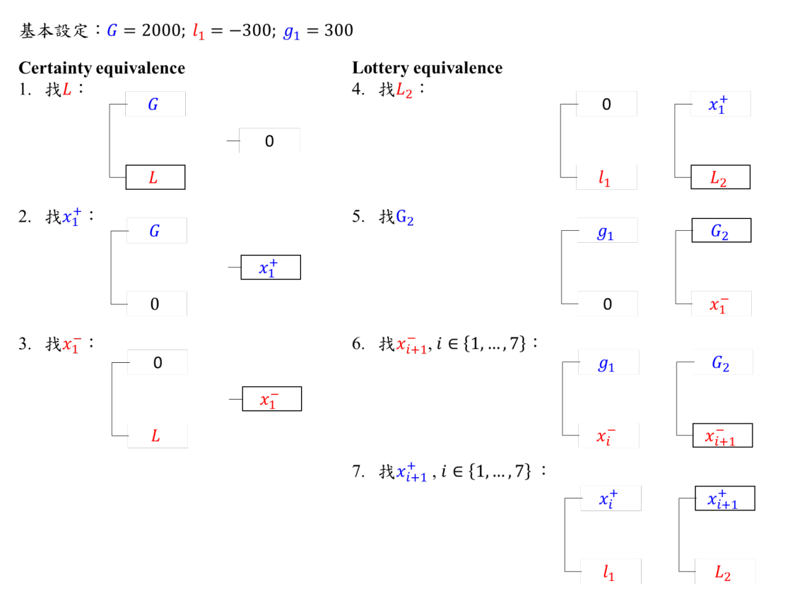

```{r setup, include=FALSE}
knitr::opts_chunk$set(
	echo = TRUE,
	fig.align = "center",
	warning = FALSE,
	rows.print=8
)
```

```{r lib, message=FALSE, include=FALSE}
library(tidyverse)
library(glue)
library(magrittr)
library(patchwork)
# import functions
# source("../functions/game_and_exp.R")
source("../functions/TO_exp.R")
# source("../functions/loss_aver_functions.R")
theme_set(theme_bw())
```


# Overview of @abdellaouiMeasuring2016 experiment Settings
 

<center>

</center>


3 equivalence needed to elicit. 
$$
\begin{align}
(G, .5; \mathbf{L}) &\sim 0\\
(G, .5; 0) &\sim \mathbf{x_1^+}\\
(0, .5; L) &\sim \mathbf{x_1^-}\\
\end{align}
$$

## Bisection Method

@abdellaouiParameterFree2000, @abdellaouiLoss2007, @abdellaouiMeasuring2016 等文章皆有使用，@abdellaouiParameterFree2000 該篇描寫較為詳盡，以下解讀多是參考該篇。


### General Case:

假設現在要找一數 $y$, 且已知$y$介於區間$[l,u], l<u$之間，  bisection method 如下:

1.  設定Starting value為中點
    * $y\leftarrow \frac{(l+u)}{2}$

2.  根據受試者的選擇決定y的範圍要如何縮小
    * 如果包含y的選項(lottery)被選擇，代表 y 比較吸引人，下次更新應該數值應該要比現在小，更新區間$[l, u]$中upper bound: $u\leftarrow \frac{(l+u)}{2}$。
    * 反之亦然，若**不**包含y的選項(lottery)被選擇，更新區間$[l, u]$中lower bound: $l\leftarrow \frac{(l+u)}{2}$
  
3.    Assign y 為新的區間中之中點(如1. )，回到2.，直到設定的bisection 次數結束。


### 實例: TO實驗中

實驗中要測得的$L, x_1^+, x_1^-$，可以由觀察得到 $L \in (-\infty, 0)$,
$x_1^+ \in (0, G)$, $x_1^- \in (L, 0)$ (滿足Stochastic dominance)。其中為了讓$L$有下界，
直接參照 @abdellaouiMeasuring2016 之作法，設定 $L \in (-2G, 0)$, 且 $L$的初始值直接是$-G$。


### Drawback:

Bisection 透過中點對半切的方式來快速縮減到所求數值，不過一旦沒有選中的那半邊永遠
沒辦法再被探索到。因此受試者只要有一次選擇「錯誤」，不管之後再進行多少次bisection
，最後的估計都會是biased。這點也可從之後的模擬稍微看見。

## Slider(scrollbar)

@abdellaouiMeasuring2016 採用的是先進行三次bisection縮減區間後，再讓受試者直接選擇
indifference point. 但為了讓受試者可以有犯錯的機會，最後使用的slider區間有動一點手腳變寬，如下:

假設bisection結束後得到區間為$[l_B, u_B], l_B<u_B$, 且令$\Delta = u_B-l_B$,
則受試者使用Slider限定的區間$[l_s,u_s] = [l_B-\Delta, u_B+\Delta].$

### Potential Drawback:

bisection法這類choice-based原先就是擔心slider 這種 matching 法(見 @bosticEffect1990)
可能有bias 所因應。現縮減範圍後再使用slider或許無法消除bias，只是限制bias的大小
不要太超過而已。

# Simulation Setting

```{r params}
# Simulation Parameters
Nsim <- 1000
phi_abd <- 0.043 
param = list("alpha"=.88, "beta"=.88, "lambda"=2.25, "wp"=.5, "wn"=.5)
exp_param = list(
  init_values =
    c("G"= 2000L,
      "g"=300L, "l"=-300L, "x1+"=1000L),
  random_init = FALSE,
  stop_crit = 5L,
  step_size = 320L
)
mix_param = list(UD_delta = 20L, # step size change to UD method
                 stop_rev_times = 4L) # time for reversal
```

## Agent

模擬的agent做出每個選擇主要有 2 個部分，如下:

1. agent 計算每個lottery 的價值是依據 Cumulative Prospect Theory [@tverskyAdvances1992]

2. agent 根據計算兩個lottery之間價值的差異，最後以lottery function轉換，產出選擇每個lottery的機率，再根據此機率進行選擇

另外，這部分模擬主要操弄的是Bisection 次數、以及是否在最後一次使用slider進行選擇，每一個情況下**皆重複 1000 次**。

下面小節會描述這些模擬實作上的細節。

### CPT:

Following @tverskyAdvances1992, using power family utility function 
$U(x)=\begin{cases}x^{\alpha},\;x\geq 0\\-\lambda |x|^{\beta},\;x<0 \end{cases}$,
with parameter values: $\alpha=\beta=0.88;\lambda=2.25$, and set both gain and loss weighting function for 0.5 as
0.5, i.e.,
$w^+(0.5)=w^-(0.5)=0.5.$


```{r find_optimal, include=FALSE}
opt <- find_optimal_params(params = 
                             list("alpha"=.88, "beta"=.88, "lambda"=2.25, "wp"=.5, "wn"=.5))
opt
```
Under such setting, $L=-796$, $x_1^+=910$, $x_1^-=-362$ (rounding to integer) theoretically,
and the KW loss aversion coefficient $\lambda= \frac{-x_1^+}{x_1^-}$
(@kobberlingIndex2005; @abdellaouiMeasuring2016) is `r -opt[4]|> round(3)`.

### Choice Rule:

模擬選擇的random error, follow softmax choice rule:

$$
\text{Let } \Delta = \text U(A)-\text U(B)),\\
\text{Pr}(A) = \sigma(\Delta|\phi)=\frac{1}{1+\exp(-\phi\Delta)} \quad\text{(softmax)}
$$
$\phi$越大，選擇越決定性; 反之，越小越隨機。

藉由 @abdellaouiMeasuring2016 中 Consistency Check 報告數值，$\phi$ 
設定為 $`r phi_abd <- 0.043; phi_abd`$。 見下討論此數值如何求出。
和之前的設定使用的$\phi = 0.2$ 相比小了許多，猜想是 @nilssonHierarchical2011, @glocknerCognitive2012 
兩篇相比起來使用的刺激(lottery)數值小了許多。

#### Tuning $\phi$

@abdellaouiMeasuring2016 之 Consistency check 考慮是$x_2^+,x_2^-$ 的最後一次(亦即第3次)選擇
得到。以$x_2^+$為例以即找到$\mathcal{L}, x_2^+$使得
$$
\begin{align}
(x_1^+, .5; \mathcal{L}) &\sim (0, .5; \mathcal{l}(=-300))\\
(\mathbf{x_2^+}, .5; \mathcal{L}) &\sim (x_1^+, .5; \mathcal{l})\\
\end{align}
$$
在模擬情況下 $x_1^+, \mathcal{L}, x_2^+$ 皆可算出，而$x_2^+\in(x_1^+, \infty)$, 且 $x_2^+$ 在 @abdellaouiMeasuring2016 設定中第一次的刺激大小即為使兩lottery 期望值相等，即${x_2^+}^{(0)}=x_1^+ +\mathcal{l} - \mathcal{L}$, 注意若要滿足stochastic dominance, $\mathcal{L}<\mathcal{l}$。

自此可得出 Bisection 的一開始的範圍為$(x_1^+, x_1^+ +2(\mathcal{l} - \mathcal{L}))$ 長度為 $R_0 = 2 \times (l-\mathcal{L})$，假設第三次選擇時縮小的區間包含真值，此時的刺激呈現(中點)與真值的差異最大值就是此時範圍的一半，即$\delta=R_0/2^3=(l-\mathcal{L})/2^2$。

此時兩選項的效用差異為 $\left[0.5 U(x_2^+ \pm\delta) + 0.5 U(\mathcal{L})\right] - \left[0.5 U(x_2^+) + 0.5 U(\mathcal{L})\right] = 0.5 \left[U(x_2^+ \pm\delta)-U(x_2^+)\right]$)

這時再計算$\sigma(U(x_2^+ +\delta) - U(x_2^+)|\phi) = 0.636$ 即可。

同理可求得$x_2^-$狀況下的$\phi$值。但這裡只使用$x_2^+$下估計的$\phi$

## Methods:

模擬主要探討數種方法，分別是 Bisection, Bisection-Slider, MOBS, PEST, ASA, mixture。

### Bisection and Bisection-Slider

-   為了和其他方法做比較，Stopping criterion 設定為final Step Size < $5$ 則停止/進入 Slider task

-   若使用 slider，最後選擇的 indifferent point 由一 normal distribution 產生(四捨五入到整數)

  -   mean 是 CPT 算出的理論值，sd 設定為$20$。
  
  -   若產生的數字超出 bisection 找出的範圍，則設定成 boundary。

### MOBS (The Modified Binary Search)

Proposed by @tyrrellRapid1988. A detailed description can be seen in @andersonComparison2006.  

This is a modification of bisection (binary search) method. Simply put, in MOBS, the stimuli wouldn't always be the midpoint of the boundary, sometimes jump to boundary itself under some conditions. So the wrongly-chosen problem in bisection should be solved under such setting. A short critic can be seen in @treutweinAdaptive1995.

### PEST

PEST 類似staircase method，但也有像bisection一樣有將step size的改變。
主要規則是受試者的選擇只要產生轉折(reversal)，就會將step size減半；若選擇方向不變，則step size維持(除了某些例外)。而只要step size最終縮小到一定程度，PEST就停止。

詳細描述如下[@bosticEffect1990].

> 1. Each time the direction of stepping changes (a reversal), halve the step size.
> 2. A step in the same direction as the last step uses the same size of step as previously, with the following exceptions:
>    - A third step in the same direction calls for a doubled step, and each successive step in the same direction is also doubled until the next reversal. This rule has its own exceptions:
>      - If a reversal follows a doubling of step size, then an extra same-sized step is taken after the original two, before doubling.
> 3. A maximum size of step is specified, at least 8 or 16 times the size of the minimum step.


Also, @choTests1994 described PEST as below. The main difference is the determination of initial step size.

> 1. The initial step size was 1/2 of the difference of the maximum and minimum outcomes.
> 2. Whenever the choice reversed (i.e., either from the gamble to the money or vice versa), the step size was halved.
> 3. When there was no reversal, the step size either remained the same or changed according to the following subrules:
>    - 3-1. After a sequence of three choices in the same direction, the step size was doubled, and it was repeatedly doubled until a reversal occurred.
>    - 3-2. If a reversal followed a doubling of the step size, the step size was decreased by one half (Rule 2), and two more steps in the same direction were required in order to double the step size.
> 4. When the step size reached 1/50 of the difference of the minimum and maximum outcomes, which was either $2 or $4, the test gamble was no longer presented. The choice CE was estimated to be the average of the lowest accepted sure amount and the highest rejected sure amount.


#### Setting of PEST

1. Initial step size: $320$, maximum 為 $1280$。

2. Criterion of Convergence: 接受最小step size 為 $5$ ，只要最後一次reversal造成step size
砍半小於5，就停止PEST，以最後一次選擇的值作為indifferent的估計。

3. Starting point: PEST 此處為了與 Bisection 相符，皆以中點作為starting point

### ASA

Proposed by @kestenAccelerated1958. Also see equation $(15)$ and $(16)$ in @treutweinAdaptive1995 for a review. 

$n+1$ 回合的刺激大小$X_{n+1}$的更新規則如下:

$$
X_{n+1} = 
\begin{cases}
  X_n - \frac{c}{n}(Z_n-\phi), & n=1,2.\\
  X_n - \frac{c}{2+m_\text{shift}}(Z_n-\phi), & n>2.
\end{cases}
$$
其中   

- $\phi$: desired threshold of psychometric function。為吻合本實驗目的，設定成 $0.5$。

- $c$ 為一常數(可以想像proportional to initial step size)，目前設定為$c = 320\times2$, i.e., first step is $320$.

- $Z_n$: Indicator variable, based on response on 
trial $n$, $Z_n = \begin{cases}1, &\text{if lottrry with tatget chosen;}\\ 0, & \text{otherwise.}\end{cases}$

- $m_\text{shift}$: number of shifts (reversals) in response category.

The step size is rounded to multiples of $5$.
Similarly, the stopping rule is when step size $< 5$.  

Also, to align to Bisection method, the starting point is set as midpoint.

### Mixture (PEST/ASA + UD)

一開始使用PEST or ASA 此類 Adaptive methods, 但在滿足一定條件後轉而使用 fixed step size 之
up-down method (以下稱 UD method, see @dixonMethod1948).

The updating rule of up-down method is taking the form below (equation $(12)$ in @treutweinAdaptive1995): 
$$
X_{n+1} = X_n - \delta(2 Z_n -1).
$$
where $\delta$ is the constant step size.

The process is stopped when the reversal times is exceed the proposed one. The final estimate can be obtained by averaging the reversal points (midrun-estimate, see @treutweinAdaptive1995), or simply the final point. For the current setting, we use midrun estimate.

In current setting:

-   up-down method is initiated when step size $\leq 4\times \delta=80$.

-   Upon initiation, the step size $(\delta)$ is set as $20$
-   Stopped when $4$ reversals happens.

-   The midrun-estimate is computed.


```{r expe testing, eval=FALSE, include=FALSE}
experiment(
      params=param, exp_params = exp_param,
      phi=0.2, u_func = "CRRA", est_type = "MOBS",
      task_log =TRUE
      )
# TODO: Fix ASA step

experiment(
      params=param, exp_params = exp_param,
      phi=0.2, u_func = "CRRA", est_type = "ASA",
      task_log =TRUE,
      mix_param = mix_param
      )
```


```{r func demo}
## Function
make_log <- function(rep, params = param, exp_params=exp_param, phi,
                     est_type =
                       c("Bisection", "Bisection-Slider", "PEST", "ASA", "MOBS"),
                     ...){
  extra.arg <- list(...)
  est_type <- match.arg(est_type)
  is.mixture <- !is.null(extra.arg$mix_param)
  if (is.mixture){
    mix_param <- extra.arg$mix_param 
  }
  for (i in 1:rep){
    if (is.mixture){
      result <- experiment(
        params=params, exp_params = exp_params,
        phi=phi, u_func = "CRRA", est_type = est_type,
        task_log = TRUE,
        mix_param = mix_param
        )
    }else{
      result <- experiment(
        params=params, exp_params = exp_params,
        phi=phi, u_func = "CRRA", est_type = est_type,
        task_log =TRUE
        )
    }
    
    # each entry is a vector
    df.tmp <- tibble(
      Nsim = i,
      L = result$log["L"], 
      x1pos = result$log["x1pos"],
      x1neg = result$log["x1neg"])

    if(i==1) {df <- df.tmp}
    else {df <- rbind(df, df.tmp)}
  }
  # df <- df %>% 
  #   mutate(lambda = -x1pos/x1neg)
  df
}
```

```{r eval=FALSE, include=FALSE}
# Testing `make_log`
make_log(
        rep = 20,
        params = param,
        exp_params = exp_param,
        phi = phi_abd,
        est_type = "MOBS"
      ) 
```

# An Overview of Simulations

There're total 4 main simulations were implemented here.

1.    Compared the statistical performance and the iteration taken between `Bisection`, `Slider`, `MOBS`, `PEST`, `ASA` and `mixture` methods. 

2.    For `mixture` methods, testing how the number of reversal used in midrun-estimate of `UD` affect its performance.

3.    Testing how starting point affect performance of `mixture` methods.

4.    To see if `mixture` methods better than other methods with loosen stop-criterion. 

## Simulation: Bisection-Slider-MOBS-PEST-ASA Result {.tabset}

以上述的agent，不同方法進行模擬，各產生1000次選擇實驗，將實驗結果收集起來。

除了觀察估計值的 biasedness, standard deviation (efficiency) 之外，亦檢查各種方法花了多少 trials 收斂。

### Codes

```{r simul_codes}
# function
cleaning <- function(df) {
  get_step <- function(vec){
    vec <- diff(vec)
    len <- length(vec)
    new_vec <- c(vec[-len], NA, NA)
    new_vec
  }
  get_last_element <- function(vec) {
    map_dbl(vec, \(x) x[length(x)])
  }
  df %>%
    mutate(
      across(L:x1neg,
              \(x) map(x, get_step), # diff 
              .names = "{.col}_step"
              ),
      across(L:x1neg,
             \(x) map_dbl(x, \(x) x[1]),
             .names = "{.col}_start"),
      across(L:x1neg,
             get_last_element,
             .names = "{.col}_est"),
      across(L:x1neg,
             \(x) map_dbl(x, length),
             .names = "{.col}_len"),
      lambda = -x1pos_est / x1neg_est
    )
}

# ----plotting params----
dir_name <- "./ASA_simulation_RDS/"
# file_names <- c("simu_phi0043_UD80_del20_rev4.RDS") 
file_names <- c("BMPAMix_rev4.RDS") 
fname <- paste0(dir_name, file_names)
pic_path <- "./figs/"

method_names <-
  c("Bisection", "Bisection-Slider", "MOBS", "PEST","PEST_UD", "ASA", "ASA_UD")
## TODO: modify the list names 0920
# ----Creating/Reading Files----
set.seed(294)
if (file.exists(fname)){
  simu.results <- readRDS(fname)
} else {
  simu.results <- list()
  for (i in 1:length(method_names)){
    start_time <- Sys.time()
    if (method_names[i] %in% c("PEST_UD", "ASA_UD")){
      method <- str_split_1(method_names[i], "_")[1]
      simu.results[[i]] <- make_log(
        rep = Nsim,
        params = param,
        exp_params = exp_param,
        phi = phi_abd,
        est_type = method,
        mix_param = mix_param
      ) 
    } else{
      simu.results[[i]] <- make_log(
        rep = Nsim,
        params = param,
        exp_params = exp_param,
        phi = phi_abd,
        est_type = method_names[i]
      ) 
    }
    time_taken <- Sys.time() - start_time
    time_taken <- time_taken |>
      as.numeric(unit = "secs")
    cat(glue("{method_names[i]} Done. It takes {time_taken} seconds. \n\n"))
  }
  rm(i, method, start_time, time_taken)
  names(simu.results) <- method_names
  names(simu.results)[2] <- "Bisection_Slider"
  simu.results <- simu.results %>%
    map(cleaning)
  if (!file.exists(dir_name)) dir.create(dir_name)
  saveRDS(simu.results, file = fname)
}
```

```{r simu_plot}
# ----Plotting function----
simu_plot2 <- function(df, fix_xlim=T, ...) {
  extra_args <- list(...)
  if (is.null(extra_args$params)){
    opt <- find_optimal_params()  
  } else{
    opt <- find_optimal_params(params)
  }
  est <- c("L", "x1pos", "x1neg")
  suffix <- c("est", "len") #, "start")
  xlims <- list("L" = c(-1000, -500),
            "x1pos" = c(650, 1200),
            "x1neg" = c(-600,-150),
            "lambda" = c(2.0, 3.5))
  # names(xlims) <- est
  # Create an empty list to store plots
  plot_list <- list()
  # Generate plots and store them in the list
  for (suf in suffix) {
    for (point in est) {
      .colname <- paste(point, suf, sep = "_")
      fig_suf  <- switch (suf,
                          "est" = "Estimates",
                          "len" = "Iteration Times")
      fig.title <- glue(" {fig_suf} of {point}")
      
      # Times of PEST
      if (suf == "len") { 
        plt <- df %>%
          # ggplot(aes_string(x = .colname)) +
          ggplot(aes(x = !!sym(.colname))) +
          geom_bar(aes(y = after_stat(count) / sum(after_stat(count))),
                   fill = "grey80", color = "black") +
          ylab("Propotion") +
          scale_x_continuous(breaks =
                               seq(min(df[[.colname]]),
                                   max(df[[.colname]]),
                                   by = 5))+
          theme(axis.text.x = element_text(angle = 45, hjust=1))
      } else { # Estimation
        plt <- df %>%
          # ggplot(aes_string(x = .colname)) +
          ggplot(aes(x = !!sym(.colname))) +
          geom_histogram(
            aes(y = after_stat(density)),
            bins = 20,
            fill = "grey80",
            color = "black"
          )
        # Fix x_limit == TRUE
        if (fix_xlim){
          plt <- plt +
          scale_x_continuous(
            limits = xlims[[point]],
            breaks = seq(xlims[[point]][1],
                         xlims[[point]][2],
                         by = ifelse(point !="lambda",
                                     50,0.2)
                         )
            ) +
          theme(axis.text.x = element_text(angle = 45, hjust=1))
        }else{
          plt <- plt +
          scale_x_continuous(breaks=scales::breaks_pretty(n=7))
        }
      }
      # 
      plt <- plt +
        xlab(point) +
        # theme(axis.text.x = element_text(angle = 10, hjust = 1)) +
        ggtitle(fig.title)
      # Add line True Value
      if (suf == "est") {
        # print(opt)
        plt <- plt +
          geom_vline(xintercept = opt[point],
                     color = "red",
                     lwd=1.1, lty = 2)
      }
      # Add the plot to the list
      plot_list[[length(plot_list) + 1]] <- plt
    }
  }
  
  # Combine plots using patchwork
  combined_plot <- wrap_plots(plot_list, ncol = 3)
  return(combined_plot)
}
```


### Summary Plots {.tabset .tabset-fade .tabset-pills}

所有方法看起來皆不偏。

**MOBS 法討論:**

-   自圖上看看起來不偏，且 sd 小於`Bisection`

-   需要trial數和`PEST_UD`, `ASA_UD`差不多。

**Mixture 法討論:**

- `PEST_UD`, `ASA_UD` 都有減少所需的 trial number，效果不錯。

- 自圖上看 `PEST_UD`, `ASA_UD` 估計上皆不偏。
  
  - 但從summary statistic上看 `PEST_UD`, 及 `ASA_UD` 在某些點上仍有小 bias 存在。
  
- 和 `PEST`, `ASA` 相比 `PEST_UD`, `ASA_UD` sd稍有膨脹。
  
  - 但仍比 `Bisection` 小。


```{r save figs, results='asis', fig.height=5, fig.width=6*1.6}
n_methods <- length(method_names)
for (i in 1:n_methods) {
  cat(paste('\n\n####', names(simu.results)[i], '\n\n'))
  plt <- simu_plot2(simu.results[[i]], opt=opt, fix_xlim = TRUE)+
          plot_annotation(title = glue("{names(simu.results)[i]}"))
  print(plt)
  # fname <- glue("{pic_path}PEST_{names(PEST.results)[i]}.png")
  # if (!file.exists(fname)) {
  #   ggsave(fname,
  #          plt,
  #          unit = "px",
  #          height = 1600,
  #          width = 2560)
  # }
}
rm(plt)
```


#### All $\lambda$ 

$\lambda$ 估計量的整理。

```{r lambda figs, echo=FALSE, fig.height=7, fig.width=7}
lambda_plot <- function(df_list, ncol, nrow, ...){
  extra_args <- list(...)
  .byrow = ifelse(is.null(extra_args$byrow),
                  TRUE,
                  extra_args$byrow)
  if (is.null(extra_args$params)){
    opt <- find_optimal_params()  
  } else{
    opt <- find_optimal_params(params)
  }
  plist <- list()
  n_methods <- length(df_list)
  for (i in 1:n_methods) {
    plt <- df_list[[i]] %>%
      ggplot(aes(x = lambda))
    plt <- plt +
      geom_histogram(aes(y = after_stat(density)),
                     bins = 30 ,
                     fill = "grey80",
                     color = "black")
    plt <- plt +
      geom_vline(
        xintercept = -opt[2] / opt[3],
        color = "red",
        lwd = 1.1,
        lty = 2
      ) +
      scale_x_continuous(limits = c(1.4, 4),
                         breaks = seq(1.4,
                                      4,
                                      .2)) +
      ggtitle( {names(df_list)[i]} )
    
    plist[[length((plist)) + 1]] <- plt
  }
  patchwork::wrap_plots(plist,
                        ncol = ncol,
                        nrow = nrow,
                        byrow = .byrow) +
    plot_annotation(title = "Lambda estimates")
}

lambda_plot(simu.results, 2,4)
# fname <- glue("{pic_path}PEST_lambda.png")
# if (!file.exists(fname)) {
#   ggsave(fname,
#          plt,
#          unit = "in",
#          height = 3.5,
#          width = 12)
# }# else{}
```

### Summary Statistics:

**整體討論:**

- 大致都是unbiased estimate.

- sd: `ASA` < `PEST` < `ASA_UD` ~= `PEST_UD` < `Bisection` ~=  `Bisection-Slider` ~= `MOBS`

- Trial number: `Bisection` < `Bisection-Slider` < `ASA_UD` ~= `PEST_UD` ~= `MOBS` < `PEST` << `ASA`

**Mixture:**

- `PEST_UD`, `ASA_UD` 都有減少所需的 trial number，效果不錯。

  - 兩者所花費的trial數差不多。
  
  - 至少 75% 的資料比起 Bisection 需要的次數可以壓在2倍以內。

- 從summary statistic上看PEST_UD 在$x_1^-$, 及ASA_UD在$x_1^+$仍有 bias (5~16)存在。
  
  - PEST_UD 在$x_1^-$ 高估，ASA_UD在$x_1^+$低估。
  
- PEST_UD, ASA_UD sd稍有膨脹。
  
  - 但仍比 Bisection 小。
  
**MOBS:**

- Trial number 比單純PEST/ASA法少，和 Mixture 法差不多。

- s.d. 比較大，有時甚至會大過Bisection (見$\lambda$, 但圖上看不出此情況，見下)

- Bias: 與 Mixture 法比較穩定，沒有其中一個parameter bias 超過 5 的情況。

#### Estimation

```{r fun_summ_stat, include=FALSE, paged.print=TRUE, rows.print=11}
summary_stats2 <- function(df) {
  df %>%
  select(Nsim, ends_with("est"), ends_with("len")) %>%
  mutate(lambda_est = -x1pos_est / x1neg_est) %>%
  pivot_longer(
    cols = -Nsim,
    names_to = c("variable", "type"),
    names_pattern = "^(.*)_(.*)$",
    values_to = "values"
  ) %>%
  group_by(type, variable) %>% 
  summarise(across(
    values,
    list(
      mean = \(x) mean(x) |> round(2),
      median = \(x) median(x, na.rm = TRUE) |> round(2),
      sd = \(x) sd(x, na.rm = TRUE) |> round(2),
      lower95 = \(x) quantile(x, .025) |> round(2),
      Q1 = \(x) quantile(x, .25) |> round(2),
      Q3 = \(x) quantile(x, .75) |> round(2),
      upper95 = \(x) quantile(x, .975) |> round(2),
      min = \(x) min(x),
      max = \(x) max(x)
    ),
    .names = "{.fn}"
    ),
  .groups = "drop")
}

make_summ_table <- function(df_list){
  n_methods <- length(df_list)
  map(df_list, summary_stats2) %>%
    bind_rows(.id = "Est_method") %>%
    mutate(
      variable = factor(variable,
                        levels = c("L", "x1pos", "x1neg", "lambda")
      )
    ) %>%
    arrange(type, variable) %>% 
    add_column(
      true_value= c(rep(opt, rep(n_methods, 4)) , rep(NA, 3*n_methods)) ,
      .after = "sd"
    ) %>%
    mutate(med_bias = round(median - true_value,2),
           mean_bias = round(mean - true_value,2),
           .after = sd)
}

BMPAMix_table <- make_summ_table(simu.results)
```

```{r stat_table, rows.print=7}
BMPAMix_table %>%
  filter(type=="est") %>% 
  select(1, variable:sd, med_bias, mean_bias, lower95, upper95) %>%
  # knitr::kable("html", caption = "Estimates b/t different methods") %>%
  # kableExtra::kable_styling(
    # bootstrap_options = "striped", full_width = F) %>%
  # kableExtra::scroll_box() 
  rmarkdown::paged_table()
```


此時Bisection 的 sd 就明顯比其他方法大許多，而MOBS的sd在$\lambda$上甚至比Bisection/Slider都還大。(但圖上 MOBS $\lambda$分布看起來比 Bisection 集中，需要再檢查)


#### Times of Iteration Takes Before Procedure Ends

```{r stat_table2, rows.print=7, results='asis'}
# cat("Times of Iteration Takes Before Procedure Ends")
BMPAMix_table %>%
  filter(type=="len") %>% 
  select(1, variable:sd, Q3, upper95) %>%
  rmarkdown::paged_table()
```

- 至少 75% 的資料，mixture method 比起 Bisection 需要的次數可以壓在2倍以內。

  - 但這是否只是因為剛好這兩點的initial points跟實際值接近? 
  
  - 驗證方式 (1) 改變 agent CPT參數 (2) 改變 starting point


```{r eval=FALSE, include=FALSE}
# TODO: Sweat Factor
```


### Trace Plot

The Trace plots below shows the trace of the stimuli in last `n` trials.

-   可以發現 MOBS 也有減少 Bisection 法中 worst case 發生的機會 (比較誇張偏離真值很多的trace沒有發生)。

```{r converge_plot}
converg.plot <- function(lastnum = 7, result_list){
  lastnum <- lastnum + 1
  plot_list <- list()
  select_last <- function(df) {
    df %>%
      mutate(across(L:x1neg,
                    \(x) map(x, \(x) tail(x, lastnum)[-lastnum]), # stary last
                    .names = "{.col}_last")) %>%
      select(1, ends_with("last")) %>%
      unnest(cols = ends_with("last")) %>%
      mutate(last_trial =
               rep(c(-(lastnum-1):-1), {{Nsim}})
             )
  }
  # Some useful objects
  combined_list <- map(result_list, select_last)
  limit.df <- combined_list %>%
    bind_rows(.id = "PEST_type") %>% 
    summarise(
      across(ends_with("last"),
             list(max = max,
                  min = min),
             .names = "{str_remove(.col, '_last')}_{.fn}"))
  for (i in 1:length(combined_list)) {
    df <- combined_list[[i]]
    df.name <- names(combined_list)[i]
    # CI dataframe
    CI.summ <- df %>%
      group_by(last_trial) %>%
      summarise(across(
        ends_with("last"),
        list(
          upper95 = ~ quantile(.x, .975),
          lower95 = ~ quantile(.x, .025)
        ),
        .names = "{str_remove(.col, '_last')}_{.fn}"
      ))
    
    for (pts in c("L", "x1pos", "x1neg")) {
      .y <-  glue(pts, "_last")
      .y_CI <- paste(pts, c("lower95", "upper95"),sep="_")
      ylim <- c(limit.df[[glue("{pts}_min")]],
                limit.df[[glue("{pts}_max")]])
      ylim <- ifelse(ylim >= 0,
                     ceiling(ylim / 5)*5L,
                     (ylim %/% 5)*5L
                     )
      
      plt <- df %>%
        ggplot() +
        geom_line(
          aes(x = last_trial, y = !!sym(.y),
              # color = Nsim,
              group = Nsim),
          color = "grey50",
          linewidth = 1,
          alpha = .15
        ) +
        geom_ribbon(data = CI.summ,
          aes(x = last_trial, ymin = !!sym(.y_CI[1]), ymax = !!sym(.y_CI[2])),
          fill = "cornflowerblue",
          alpha = .65
          ) +
        theme(legend.position = "none") +
        geom_point(
          aes(x = last_trial, y = !!sym(.y)),
          color = "grey30",
          alpha = .2
        ) +
        geom_hline(
          yintercept = opt[pts],
          color = "red", lty = 2, lwd = 1
        ) +
        scale_x_continuous(breaks = scales::breaks_pretty()) +
        scale_y_continuous(limits = ylim ,
                           breaks =
                             seq(ylim[1],
                                 ylim[2],
                                 100)
                           ) +
        # scale_colour_gradientn(colours = hcl.colors(10, alpha = .4))+
        labs(title = pts,
             subtitle = df.name,
             y = pts)
        
      plot_list[[length(plot_list) + 1]] <- plt
    }
  }
  combined_plot <- wrap_plots(plot_list, byrow = FALSE, ncol = length(result_list)) +
    plot_annotation(title = glue("Last {lastnum-1} Choice Trace"))
  combined_plot
}
```

```{r converge_plot_bisec, eval=FALSE, fig.height=7.5, fig.width=6, include=FALSE}
# 
converg.plot.bisec <- function(result_list){
  plot_list <- list()
  # Unnest along a column
  unnest_col <- function(df, column) {
    df %>%
      select(1, {{column}}) %>% 
      unnest_longer(col = {{column}}, indices_to = "Trial")
  }
  # Some useful objects
  columns_to_unnest <- c("L", "x1pos","x1neg")
  # Each Method
  for (i in 1:length(result_list)) {
    df <- result_list[[i]]
    df.name <- names(result_list)[i]
    unnested_dfs <- map(columns_to_unnest, ~ unnest_col(df, .x))
    names(unnested_dfs) <- columns_to_unnest
    # Each Estimate 
    for (j in 1:length(unnested_dfs)){
      unnest_df <- unnested_dfs[[j]]
      pts <- columns_to_unnest[j] #names
      # limit.df <- df %>%
      #   summarise(
      #   across(ends_with("last"),
      #          list(max = max,
      #               min = min),
      #          .names = "{str_remove(.col, '_last')}_{.fn}"))
      CI.summ <- unnest_df %>%
        group_by(Trial) %>% 
        summarise(
            upper95 = quantile( !!sym(pts), .975),
            lower95 = quantile( !!sym(pts), .025)
            )
      
      .y <- pts
      .y_CI <-  c("lower95", "upper95")
      # ylim <- c(limit.df[[glue("{pts}_min")]],
      #           limit.df[[glue("{pts}_max")]])
      # ylim <- ylim %/% 50 *50
      
      plt <- unnest_df %>%
        ggplot() +
        geom_line(
          aes(x = Trial, y = !!sym(.y), # symbol
              # color = Nsim,
              group = Nsim),
          color = "grey50",
          linewidth = 1,
          alpha = .15
        ) +
        geom_ribbon(data = CI.summ,
          aes(x = Trial, ymin = !!sym(.y_CI[1]), ymax = !!sym(.y_CI[2])),
          fill = "cornflowerblue",
          alpha = .65
          ) +
        theme(legend.position = "none") +
        geom_point(
          aes(x = Trial, y = !!sym(.y)),
          color = "grey30",
          alpha = .2
        ) +
        geom_hline(
          yintercept = opt[pts],
          color = "red", lty = 2, lwd = 1
        ) +
        scale_x_continuous(breaks = scales::breaks_pretty()) +
        # scale_y_continuous(limits = ylim ,
        #                    breaks =
        #                      seq(ylim[1],
        #                          ylim[2],
        #                          100)
        #                    ) +
        # scale_colour_gradientn(colours = hcl.colors(10, alpha = .4))+
        labs(title = pts,
             subtitle = df.name,
             y = pts)
        
      plot_list[[length(plot_list) + 1]] <- plt
    }
  }
  combined_plot <- wrap_plots(plot_list, byrow = FALSE, ncol = length(result_list)) +
    plot_annotation(title = glue("Choice Trace by All Trials"))
  combined_plot
}
```

```{r eval=FALSE, include=FALSE}
# converg.plot.bisec(result_list = simu.results[c(1,2)])
```

#### All Methods 

```{r converge, fig.height=9, fig.width=19}
# converg.plot(lastnum = 7, result_list = simu.results[c(-5,-6)])
converg.plot(lastnum = 7, result_list = simu.results)
```

#### PEST/ASA and Mixture 

```{r converge2, echo=TRUE, fig.height=9.5, fig.width=13}
converg.plot(lastnum = 7,  result_list = simu.results[c(-1,-2,-3)])
```

#### Bisections and Mixture 

```{r converge3, echo=TRUE, fig.height=8, fig.width=13}
converg.plot(lastnum = 7,  result_list = simu.results[c(-4,-6)])
```


### 小結

- 在不同方法都大致unbiased的前提下，`PEST_UD` 和 `ASA_UD` 似乎是 sd 大小和 trial 數之間trade-off最好的方法
  
  -   兩者差不多的情況下，`ASA_UD` 較有理論基礎，且implementation上較簡易。

---

## Simulation: UD reversal times{.tabset}

Modify the number of reversal before end of UD part in mixture method.
The simulation results were called `ASA_UD1` - `ASA_UD4`, and `PEST_UD1` - `PEST_UD4`. The index `1-4` represent the number of reversals before UD process end.

For `UD1`, 如果第一次 reversal 發生在 step size 還不是 $\delta=20$ 時，最終估計使用 $X_{n} \pm 20$ 而非 $X_n$.  

```{r codes_simulation }
file_names <- c("mixture_rev1-4.RDS") 
fname <- paste0(dir_name, file_names)
pic_path <- "./figs/"

method_names <-
  c(paste0("PEST_UD", 1:4), paste0("ASA_UD", 1:4))
# ----Creating/Reading Files----
set.seed(294)
if (file.exists(fname)){
  # read exist RDS file
  UDsimu.results <- readRDS(fname)
} else {
  UDsimu.results <- list()
  mix_param.tmp <- mix_param
  for (i in 1:length(method_names)){
    start_time <- Sys.time()
      method <- str_split_1(method_names[i], "_")[1]
      n_rev <- str_split_1(method_names[i], "UD")[2] |>
        as.integer()
      mix_param.tmp$stop_rev_times <- n_rev
      UDsimu.results[[i]] <- make_log(
        rep = Nsim,
        params = param,
        exp_params = exp_param,
        phi = phi_abd,
        est_type = method,
        mix_param = mix_param.tmp
      )
      time_taken <- Sys.time() - start_time
      time_taken <- time_taken |>
        as.numeric(unit = "secs")
      cat(glue("{method_names[i]} Done. It takes {time_taken} seconds. \n\n"))
  }
  rm(i, method, start_time, time_taken, mix_param.tmp)
  names(UDsimu.results) <- method_names
  UDsimu.results <- UDsimu.results %>%
    map(cleaning)
  if (!file.exists(dir_name)) dir.create(dir_name)
  saveRDS(UDsimu.results, file = fname)
}
```

### Summary Plots {.tabset .tabset-fade .tabset-pills}

-   可以發現當 UD reversal times = 1 (`UD1`)時，最終估計量的分布有些不穩定，是雙峰or 多峰的情況。到 `UD2`, `UD3` 就較固定為單峰。

-   隨 UD reversal times 增加，trial number 增加，但分布也越集中。


```{r summplot_UD, results='asis', fig.height=5, fig.width=6*1.6}
n_methods <- length(method_names)
for (i in 1:n_methods) {
  cat(paste('\n\n####', names(UDsimu.results)[i], '\n\n'))
  plt <- simu_plot2(UDsimu.results[[i]], opt=opt, fix_xlim = TRUE)+
          plot_annotation(title = glue("{names(UDsimu.results)[i]}"))
  print(plt)
}
rm(plt)
```

#### $\lambda$ Estimates

```{r lambda2_figs, echo=FALSE, fig.height=7, fig.width=7}
lambda_plot(UDsimu.results, 2, 4, byrow= FALSE)
```

### Summary Statistics

-   Except having greater bias, `PEST_UD1` or `ASA_UD1` has similar performance (and trial number) to `Bisection` methods.
  -   trial number median is approximately $10$. 

-   隨 UD reversal times 增加:
  
  -   sd 降低
  
  -   trial number 上升 1-2 次 (median)

-   `PEST_UD` 在 $x_1^+$ 上 Bias 的 pattern 較為相似，並未隨著UD reversal times 增加而消失。

#### Summary Statistics of Estimates

```{r stat_table_UD, rows.print=8}
UDrev_table <- make_summ_table(UDsimu.results) %>% 
  bind_rows(BMPAMix_table |> 
    filter(Est_method == "Bisection")
    ) %>% 
  arrange(variable)
```

```{r est_table_UD, rows.print=9}
UDrev_table %>%
  filter(type=="est") %>% 
  select(1, variable:sd, med_bias, mean_bias, lower95, upper95) %>% 
  # knitr::kable("html", caption = "Estimates b/t different methods") %>%
  # kableExtra::kable_styling(
    # bootstrap_options = "striped", full_width = F) %>%
  # kableExtra::scroll_box() 
  rmarkdown::paged_table()
```

#### Iteration Times

```{r iter_times_table_UD, rows.print=9}
UDrev_table %>%
  filter(type=="len") %>% 
  select(1, variable:sd, min, Q3, upper95) %>%
  rmarkdown::paged_table()
```

### Converge Plot

#### PEST_UD
```{r conv2, fig.height=9, fig.width=13}
converg.plot(lastnum = 5, result_list = UDsimu.results[1:4])
```

#### ASA_UD
```{r conv22, fig.height=9, fig.width=13}
converg.plot(lastnum = 5, result_list = UDsimu.results[5:8])
```

#### PEST_UD and ASA_UD 

```{r ASA_PEST, fig.height=9, fig.width=13}
converg.plot(lastnum = 5, result_list = UDsimu.results[c(2, 6, 3, 7)])
```

---

## Simulation: Random Initial Points for mixture Methods {.tabset}

The simulation results have shown that mixture methods can effectively shorten the iterations taken (compared to `ASA`, `PEST` only). However, a concern may raise that the results were due to the closeness between starting point and the true parameter value. To rule out this kind of confound, the mixture methods with random starting point are carried out in the simulation below.

The simulation compares `PEST_UD3`, `ASA_UD3` for fixed (midpoint) and random starting point. In random starting point, the initial point follows a uniform distribution (rounded to multiples of 5) of the interval. 

### Codes

```{r rand_init}
file_names <- c("mixture_rand_init.RDS") 
fname <- paste0(dir_name, file_names)

method_names <-
  c("PEST_UD3", "PEST_UD3_random_init", "ASA_UD3", "ASA_UD3_random_init")
# ----Creating/Reading Files----
set.seed(294)
if (file.exists(fname)){
  # read exist RDS file
  rand_init.results <- readRDS(fname)
} else {
  rand_init.results <- list()
  exp_param.tmp <- exp_param
  mix_param.tmp <- mix_param
  mix_param.tmp$stop_rev_times <- 3L
  for (i in 1:length(method_names)){
    start_time <- Sys.time()
    name_vec <- str_split_1(method_names[i], "_")[1]
    method <- name_vec[1]
    exp_param.tmp$random_init <- name_vec >= 3
    rand_init.results[[i]] <- make_log(
      rep = Nsim,
      params = param,
      exp_params = exp_param.tmp,
      phi = phi_abd,
      est_type = method,
      mix_param = mix_param.tmp
    )
    time_taken <- Sys.time() - start_time
    time_taken <- time_taken |>
      as.numeric(unit = "secs")
    cat(glue("{method_names[i]} Done. It takes {time_taken} seconds. \n\n"))
  }
  rm(i, method, name_vec, start_time, time_taken,
     exp_param.tmp, mix_param.tmp)
  names(rand_init.results) <- method_names
  rand_init.results <- rand_init.results %>%
    map(cleaning)
  if (!file.exists(dir_name)) dir.create(dir_name)
  saveRDS(rand_init.results, file = fname)
}
```

### Summary Plots {.tabset .tabset-fade .tabset-pills}

-   圖上可看出random initial point 對於測量結果、trial數的分布幾乎沒有影響、支持 UD 法降低trial number 跟 initial point 較無關。

```{r summplot_rand_init, results='asis', fig.height=5, fig.width=6*1.6}
n_methods <- length(method_names)
for (i in 1:n_methods) {
  cat(paste('\n\n####', names(rand_init.results)[i], '\n\n'))
  plt <- simu_plot2(rand_init.results[[i]], opt=opt, fix_xlim = TRUE)+
          plot_annotation(title = glue("{names(rand_init.results)[i]}"))
  print(plt)
}
rm(plt)
```

#### $\lambda$ Estimates

```{r lambda23_figs, echo=FALSE, fig.height=5, fig.width=7}
lambda_plot(rand_init.results, 2, 2, byrow = FALSE)
```

### Summary Statistics {.tabset .tabset-fade .tabset-pills}

#### Summary Statistics of Estimates

```{r stat_randinit, rows.print=5}
rand_init_table <- make_summ_table(rand_init.results) %>% 
  bind_rows(BMPAMix_table |> 
    filter(Est_method == "Bisection")
    ) %>% 
  arrange(variable)

rand_init_table %>%
  filter(type=="est") %>% 
  select(1, variable:sd, med_bias, mean_bias, lower95, upper95) %>%
  # knitr::kable("html", caption = "Estimates b/t different methods") %>%
  # kableExtra::kable_styling(
    # bootstrap_options = "striped", full_width = F) %>%
  # kableExtra::scroll_box() 
  rmarkdown::paged_table()
```

#### Trial Number

```{r len_randinit, rows.print=5}
rand_init_table %>%
  filter(type=="len") %>% 
  select(1, variable:sd, Q3, upper95) %>%
  # knitr::kable("html", caption = "Estimates b/t different methods") %>%
  # kableExtra::kable_styling(
    # bootstrap_options = "striped", full_width = F) %>%
  # kableExtra::scroll_box() 
  rmarkdown::paged_table()
```

### Converge Plot

```{r trace_rand1, fig.height=9, fig.width=13}
converg.plot(lastnum = 7, result_list = rand_init.results)
```

## {-}

The simulation shows no inferior results (both estimates and iteration times taken) in the random-initial version of the mixture-method.

One may then argue that individual difference of true parameter distribution weights more than the initial point in the starting-point/true parameter value distance problem. It does worth performing another simulation.

---

## Simulation: Changing stop-criterion for non-mixture methods. {.tabset}

In this section, here I want to show if the mixture-method sill have the advantages (relatively less iteration takes and the unbiasedness and efficiency) compare to other methods after we loosen the stop-criterion.

```{r include=FALSE}
.exp_param <- exp_param
.exp_param$stop_crit <- 20L

method_names <-
  c("Bisection", "Bisection-Slider", "MOBS",
    "PEST", "PEST_UD3", "PEST_UD4",
    "ASA","ASA_UD3", "ASA_UD4")
```

In the simulation below, we loosen the stop-criterion (step size before stop) from $`r exp_param[["stop_crit"]]`$ to $ `r .exp_param[["stop_(crit"]]`$. And we compare these methods: `r method_names`.

### Codes

```{r}
# ----plotting params----
dir_name <- "./ASA_simulation_RDS/"
file_names <- c("BMPAMix_more.RDS") 
fname <- paste0(dir_name, file_names)

# ----Creating/Reading Files----
set.seed(294)
if (file.exists(fname)){
  BMAPmix.more <- readRDS(fname)
} else {
  BMAPmix.more <- list()
  .mix_param <- mix_param
  for (i in 1:length(method_names)){
    start_time <- Sys.time()
    name_vec <- str_split_1(method_names[i], "_")
    if (length(name_vec) > 1){
      method <- name_vec[1]
      UDshift <- str_split_1(method_names[i], "UD")[2] |>
        as.integer()
      .mix_param$stop_rev_times <- UDshift
      BMAPmix.more[[i]] <- make_log(
        rep = Nsim,
        params = param,
        exp_params = .exp_param,
        phi = phi_abd,
        est_type = method,
        mix_param = .mix_param
      ) 
    } else{
      BMAPmix.more[[i]] <- make_log(
        rep = Nsim,
        params = param,
        exp_params = .exp_param,
        phi = phi_abd,
        est_type = method_names[i]
      ) 
    }
    time_taken <- Sys.time() - start_time
    time_taken <- time_taken |>
      as.numeric(unit = "secs")
    cat(glue("{method_names[i]} Done. It takes {time_taken} seconds. \n\n"))
  }
  rm(i, method,.exp_param, .mix_param, name_vec, UDshift, start_time, time_taken)
  names(BMAPmix.more) <- method_names
  names(BMAPmix.more)[2] <- "Bisection_Slider"
  BMAPmix.more <- BMAPmix.more %>%
    map(cleaning)
  if (!file.exists(dir_name)) dir.create(dir_name)
  saveRDS(BMAPmix.more, file = fname)
}

```

### Summary Plots {.tabset .tabset-fade .tabset-pills}

The Bisection-Slider seems to have great results because in the simulation setting, the `sd` of final judgement is relatively smaller now.

```{r  sss, results='asis', fig.height=5, fig.width=6*1.6}
n_methods <- length(method_names)
for (i in 1:n_methods) {
  cat(paste('\n\n####', names(BMAPmix.more)[i], '\n\n'))
  plt <- simu_plot2(BMAPmix.more[[i]], opt=opt, fix_xlim = TRUE)+
          plot_annotation(title = glue("{names(BMAPmix.more)[i]}"))
  print(plt)
  # fname <- glue("{pic_path}PEST_{names(PEST.results)[i]}.png")
  # if (!file.exists(fname)) {
  #   ggsave(fname,
  #          plt,
  #          unit = "px",
  #          height = 1600,
  #          width = 2560)
  # }
}
rm(plt)

cat(paste('\n\n####', '$\\lambda Plot$', '\n\n'))
lambda_plot(BMAPmix.more, 3,3, byrow = FALSE)

```


### Summary Statistics {.tabset .tabset-fade .tabset-pills}

#### Summary Statistics of Estimates

```{r, rows.print=9}
BMPAMix_table <- make_summ_table(BMAPmix.more)

BMPAMix_table %>%
  filter(type=="est") %>% 
  select(1, variable:sd, med_bias, mean_bias, lower95, upper95) %>%
  # knitr::kable("html", caption = "Estimates b/t different methods") %>%
  # kableExtra::kable_styling(
    # bootstrap_options = "striped", full_width = F) %>%
  # kableExtra::scroll_box() 
  rmarkdown::paged_table()
```

#### Summary Statistics of Iteration Times

```{r, rows.print=9}
BMPAMix_table %>%
  filter(type=="len") %>% 
  select(1, variable:sd, Q3, upper95) %>%
  rmarkdown::paged_table()

```


# Future Directions


-   除了sd 可能也可以討論 sweat factor $K$ (Taylor and Creelman, 1967; Taylor, 
1971; Also see equation (8) in @treutweinAdaptive1995 作為 Efficiency 的評斷指標。

>It (*Sweat factor*) is the product of $\sigma_{\hat{\theta}}^2$, the variance of the best threshold estimate, 
and $n$, the fixed number of trials, which were necessary 
to obtain that estimate $K = n\sigma_{\hat{\theta}}^2.$

-  Try different CPT agents.
  
  -   Changing model parameters  of utility function ($\alpha, \beta, \lambda$).
  
  -   Varying sensitivity parameter $\phi$    

-  Initial step size in PEST/ASA method can be flexibly modified with the interval range.
(e.g., step size = $\text{range}/4$), see @choTests1994.

---
# References
