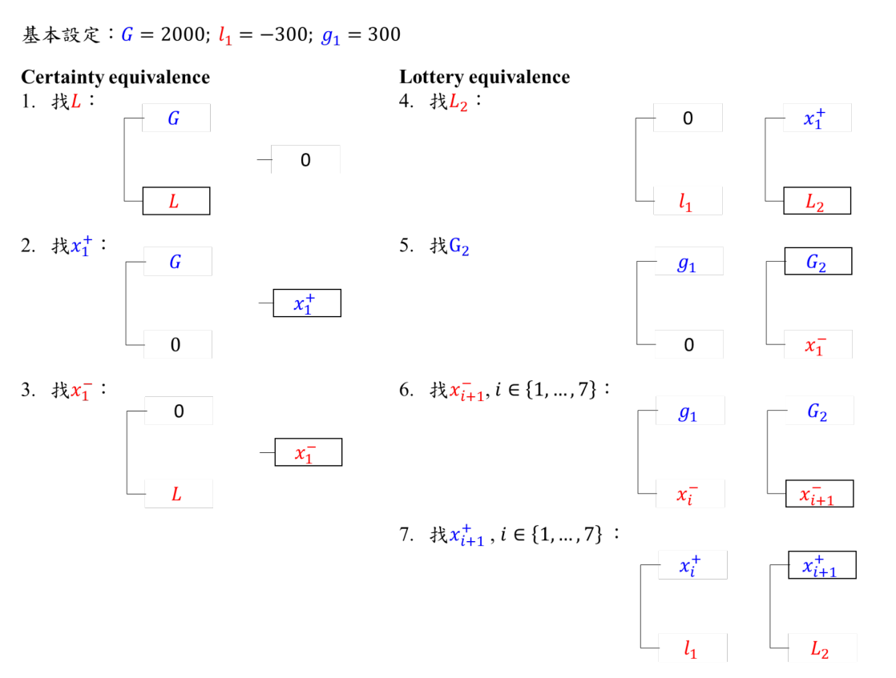

```{r setup, include=FALSE}
knitr::opts_chunk$set(echo = TRUE,
                       fig.align='center')
```

```{r lib, message=FALSE, include=FALSE}
library(R6)
library(tidyverse)
library(magrittr)
# import functions
source("../functions/exper_simu_functions_x1only.R")
# source("../functions/loss_aver_functions.R")
theme_set(theme_bw())
```


# Settings
 
   

3 equivalence elicited. 
$$
\begin{align}
(G, .5; \mathbf{L}) &\sim 0\\
(G, .5; 0) &\sim \mathbf{x_1^+}\\
(0, .5; L) &\sim \mathbf{x_1^-}\\
\end{align}
$$
With parameters G = 2000
using 5 bisections to determine indifference.

## Simulation Setting
### CPT:
follow Tversky & Kahnaman's Utility function, and set both weighting function for 0.5 as 
$w(0.5)=0.5$
Parameters:$\alpha=\beta=0.88;\lambda=2.25$

### Choice Rule:
模擬選擇的random error, follow softmax choice rule:

$$
\text{Pr}(A) = \frac{1}{1+\exp[-\phi(\text U(A)-\text U(B))]} \quad\text{(softmax)}
$$
$\phi$越大(>1)，選擇越決定性;反之，越小越隨機。


## log

`$log[[1]]`: $L$, 最後一項是 $L$ 之 bisection 最終結果。

`$log[[2]]`: $x_1^+$

`$log[[3]]`: $x_1^-$


```{r func demo}
param = list("alpha"=.88, "beta"=.88, "lambda"=2.25, "wp"=.5, "wn"=.5)
exp.param = list(
  n_task = 5L,
  init_values =
    c("G"= 2000L, "L"=-2000L,"g"=300L, "l"=-300L, "x1+"=1000L)
)

make_log <- function(rep, params = param, exp_params=exp.param, phi=0.1){
  for (i in 1:rep){
    result <- experiment(params=params, exp_params = exp_params,
                         phi=phi, u_func = "CRRA", T, F)
    # c(result$log[[1]],result$log[[2]],result$log[[3]]) 
    df.tmp <- data.frame(
      result$log,
      "Bisection"=1:(exp_params$n_task+1), "Nsim"=i)
    if (i==1){
      df <-  df.tmp
    }else{
      df <- rbind(df, df.tmp)
    }
  }
  df
}
# Nsim <-  100
experiment(params=param, exp_params = exp.param,
                         phi=.2, u_func = "CRRA", T, F)$log
```

```{r}
exp.param = list(
  n_task = 10L,
  init_values =
    c("G"= 2000L, "L"=-2000L,"g"=300L, "l"=-300L, "x1+"=1000L)
)

experiment(params=param, exp_params = exp.param,
                         phi=NA, u_func = "CRRA", T, F)$log

```

# randomness

$\phi=0.2$, consistency about $x_1^+$ about 97.6%, $x_1^-$ about 86.7%, $x_1^-$ about 97.6%.

```{r, fig.width =8, fig.height = 12}

param <- list("alpha"=.88, "beta"=.88, "lambda"=2.25, "wp"=.5, "wn"=.5)

Nsim <- 1000
n <- c(5L, 7L,8L,10L)
exp.result <- list()

par(mfrow = 
      # c(2,2)
      c(length(n),3)
    )
for (i in 1:length(n)){
  exp.param = list(
    n_task = n[i],
    init_values =
      c("G"= 2000L, "L"=-2000L,"g"=300L, "l"=-300L, "x1+"=1000L)
  )
  exp.result[[i]] <- make_log(Nsim, phi=.2)
  
  tmp <- exp.result[[i]] %>%
    filter(Bisection==n[i]+1) 
  for (column in c("L"
                   , "x1pos", "x1neg"
                   )
       ){
    (table(tmp[column])/Nsim) %>%
      barplot( main = paste0(column, " estimate from bisection=", exp.param$n_task))
  } 
  # cat(i, "finished\n")
}
```

```{r table}
for (i in 1:4){
  for (column in c("L"
                   , "x1pos", "x1neg"
                   )
       ){
    cat("---", column,": bisecton =", n[i], "---\n")
    .tbl <- exp.result[[i]] %>%
      filter(Bisection==n[i]+1) %>% 
      pull({column}) %>% 
      table() 
    print(.tbl[.tbl>60])
  } 
  # cat(i, "finished\n")
}

```


```{r}
exp.result[[1]] %>%
  mutate(Nsim = as.factor(Nsim)) %>% 
  group_by(Nsim) %>% 
  ggplot(aes(x=Bisection, y = x1pos)) +
  geom_line(aes(color = Nsim, group = Nsim), linewidth=1.2)+
  geom_point()+
  theme(legend.position = "none")+
  ggtitle("x1+, bisection = 5")
 
```

```{r echo=FALSE}
exp.result[[1]] %>%
  mutate(Nsim = as.factor(Nsim)) %>% 
  group_by(Nsim) %>% 
  ggplot(aes(x=Bisection, y = L)) +
  geom_line(aes(color = Nsim, group = Nsim), linewidth=1.2)+
  geom_point()+
  theme(legend.position = "none")+
  ggtitle("L, bisection = 5")
 
```

```{r, echo=FALSE}
exp.result[[2]] %>%
  mutate(Nsim = as.factor(Nsim)) %>% 
  group_by(Nsim) %>% 
  ggplot(aes(x=Bisection, y = x1pos)) +
  geom_line(aes(color = Nsim, group = Nsim), linewidth=1.2)+
  geom_point()+
  theme(legend.position = "none")+
  ggtitle("x1+, bisection = 7")
```
```{r echo=FALSE}
exp.result[[2]] %>%
  mutate(Nsim = as.factor(Nsim)) %>% 
  group_by(Nsim) %>% 
  ggplot(aes(x=Bisection, y = L)) +
  geom_line(aes(color = Nsim, group = Nsim), linewidth=1.2)+
  geom_point()+
  theme(legend.position = "none")+
  ggtitle("L, bisection = 7")

```


